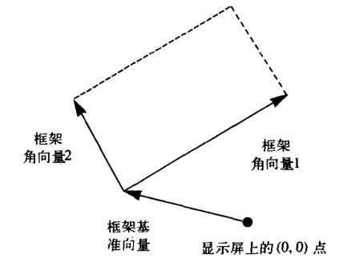

这几天一直在看SICP 2.2.4小节的[图形语言](https://mitpress.mit.edu/sicp/full-text/book/book-Z-H-15.html#%_sec_2.2.4)，在看这个图形语言时，真是应了[学习的三个境界](http://www.cnblogs.com/1-2-3/archive/2008/10/28/three-level-of-study.html)：

1. 见山是山，见水是水；
2. 见山不是山，见水不是水；
3. 见山是山，见水是水

为了加深理解，现在分享一下我对这个图形语言的理解，希望对今后阅读SICP的人所有帮助。

首先，要明确，在描述一门语言时，我们主要关注其三部分：

- 基本原语
- 组合手段
- 抽象手段

下面的讲解也着重按照这三部分进行讲解。

## 基本原语

这一图形语言的优雅之处在于，该语言只有一种元素，称为painter（画家）。

### painter 画家

一个画家能够画出一个图形，借助于frame（相当于画板）的形状，可以对该画家所对应的图形进行变形。

在这个图形语言里，画家用有一个参数的过程来表示，而这个参数正是画板，通过在调用画家时传入一个画板参数，我们将得到一个画。

#### frame 画板

画板算是这个图形语言中比较重要的一个概念，因为它决定了画家所代表的画的最终形态，用三个向量表示，一个基准向量（用origin表示），两个角向量（分别用Edge1与Edge2表示）。如下图所示：



这个图形语言有一个约定：`画家所表示的图形用1*1的单位正方形的坐标`来描述。所以，为了能够方便的表示画家在给定画板上的坐标，我们需要有一个坐标转换函数，把这个单位正方形的坐标映射到相应画板的坐标中去，所采用的方式也就是将向量`v=(x, y)`映射到下面的向量和：

```
origin(Frame) + x * Edge1(Frame) + y * Edge2(Frame)
```
用Scheme代码表示如下：
```
(define (frame-coord-map frame)
  (lambda (v)
    (add-vect
      (origin-frame frame)
      (add-vect (scale-vect (xor-vect v)
                            (edge1-frame frame))
                (scale-vect (yor-vect v)
                            (edge2-frame frame))))))
```

题外话：

> 中文版SICP将frame翻译成了“框架”，实在是觉得难以理解，我觉得将其意译为“画板”更合适。

## 抽象手段

本图形语言采用本章着重讲解的数据抽象来达到分层设计的目的，比如上面的frame，我们不需要关心frame到底是如何实现的，我们只需要知道它的

- 构造函数`make-frame`，能够从三个向量出发做出一个框架
- 选择函数`origin-frame`、`edge1-frame`、`edge2-frame`，能够选择出一个框架的相应向量

其次是画家本身也个高度抽象后的结果，只要是Scheme中的过程，接受一个frame参数，画出某些经过伸缩后可适合这个框架的东西，那么这个过程就可以被看作是一个画家。

## 组合手段

组合指的是把对画家的基本操作组合起来，形成更为复杂的操作，像`square-limit`这样复杂的变换就是通过基本的`beside`、`below`来实现的。

由于画家用过程表示，而画家应用于某个基本操作后的返回值也是一个画家过程，也就是说满足**闭包**的性质，这就使得我们

> 可以创建和混用基于各种图形能力的各种类型的基本画家，而不用去关心该组合方式是否合法，因为这一定是合法的。

上面这句话是这个图形语言的精髓所在，而这一切都得益于***闭包***的性质，这里的闭包指的是
    
    由基本数据对象组合起来的结果本身还可以通过同样的操作再进行组合

### 画家的变换与组合


上面的两个例子都是用`transform-painter`过程来实现变换的，下面我们将介绍另一种不基于`transform-painter`变换方式，为了予以区分，分别称前者为方法1，后者为方法2。

对画家的一些基本操作，像`flip-vert`、`beside`的功能就是创建另一个画家，这其中涉及到原来的画家以及有关怎样变换画板和生成画家的信息作为参数。

因为最终的图形取决于画家与画板这两者，其中任何一个变换都会对最终的图形有所影响。所以这里有两个方法对画家进行变换：

1. 参数画板不动，对画家进行伸缩、选择等变换，称之为方法1
2. 画家不动，对参数画板进行伸缩、选择等变换，称之为方法2

#### 方法1

该方法所有对画家的操作都基于一个过程`transform-painter`，它以一个画家以及有关新画板的坐标向量为参数
```
(define (transform-painter painter origin edge1 edge2)
  (lambda (frame)
    (let ((m (frame-coord-map frame)))
      (let ((new-origin (m origin)))
        (painter
          (make-frame
            new-origin
            ;这里需要将edge1映射后的向量减去新的原点向量，因为frame的角向量是相对于原点而言的
            (sub-vect (m edge1) new-origin)
            (sub-vect (m edge2) new-origin)))))))
```

有了这个`transform-painter`后，我们可以这么定义`flip-vert`：
```
(define (flip-vert painter)
  (transform
    painter
    (make-vect 0 1)    ;新的原点
    (make-vect 1 1)    ;新的角向量edge1
    (make-vect 0 0)))  ;新的角向量edge2
```

这个变换我第一眼看上去好像是那么回事，但是在看就觉得它到底是怎么实现变换的呢，经过一番思索后，应该是这么回事，

> 我们已经知道每个画家所代表的画都是用1*1的单位正方形的坐标来表示的，我们现在需要做的是如何把这个1*1的单位正方形内的坐标映射到新的画板中。
>  
>  我们知道一个画板是用三个向量确定的（一个基准向量，两个角向量），所以如果这三个向量的映射关系确定了，那么其他的点的坐标也就跟着确定了。

这样的话， 就比较好理解了，一开始纠结点在于为什么要用`1*1`的单位正方形的坐标来描述画家，其实完全不必去关心这个，因为它代表是一种基准，我们完全可以用`100*100`的正方形坐标来描述，如果是这样，我们的`flip-vert`就要这样写了：
```
(define (flip-vert painter)
  (transform
    painter
    (make-vect 0 100)    ;新的原点
    (make-vect 100 100)  ;新的角向量edge1
    (make-vect 0 0)))    ;新的角向量edge2
```
再来一个`beside`的例子：
```
(define (beside p1 p2)
  (let ((split-point (make-vect 0.5 0)))
    (let ((l (transform-painter p1
                                (make-vect 0 0)
                                split-point
                                (make-vect 0 1)))
          (r (transform-painter p2
                                split-point
                                (make-vect 1 0)
                                (make-vect 0.5 1))))
      (lambda (frame)
        (l frame)
        (r frame)))))
```

#### 方法2

```
;这里把frame看出一个矩形（rect），
;edge1-frame相当于水平边，
;edge2-frame看成垂直边。

(define origin origin-frame)
(define horiz edge1-frame)
(define vert edge2-frame)

(define (beside p1 p2)
  (lambda (frame)
    (p1
      (make-frame
        (origin frame)
        (vector-scale 0.5 (horiz frame))
        (vert frame)))
    (p2
      (make-frame
        (vector-add
          (origin frame)
          (vector-scale 0.5 (horiz frame)))
        (vector-scale 0.5 (horiz frame))
        (vert frame)))))
        
(define (flip-vert p)
  (lambda (frame)
    (p
      (make-frame
        ;新画板的原点，是原来的原点＋垂直向量
        (vector-add (origin frame) (vect origin))
        ;新画板的水平向量，不变
        (horiz origin)
        ;新画板的水平向量，是原来垂直向量的逆
        (vector-scale -1 (vect origin))))))
```

通过代码，我们可以看到方法2直接对画家的参数画板进行相应变换。


### 画家变换的递归应用

由于该图形语言满足闭包性质，所以我们可以对其进行递归的变换，比如：
```
(define (right-split painter n)
  (if (= n 0)
    painter
    (let ((smaller (right-split painter (- n 1))))
      (beside painter
              (below smaller smaller)))))
(define (up-split painter n)
  (if (= n 0)
    painter
    (let ((smaller (up-split painter (- n 1))))
      (below painter (beside smaller smaller)))))              

(define (corner-split painter n)
  (if (= n 0)
    painter  
    (let ((right (right-split painter (- n 1)))
          (up (up-split painter (- n 1))))
      (let ((top-left (beside up up))
            (bottom-right (below right right))
            (corner (corner-split painter (- n 1))))
        (beside (below painter top-left)
                (below bottom-right corner))))))

(define (square-limit painter n)
  (let ((quarter (corner-split painter n)))
    (let ((half (beside (flip-horiz quarter) quarter)))
      (below (flip-vert half) 
             half))))
```
现用Racket中提供的该图形语言的实现（配置可参考[这里]((/exercises/02/2.44_2.45.md))），按照下面的调用方式
```
(paint (right-split einstein 3))
(newline)
(paint (up-split einstein 3))
(newline)
(paint (corner-split einstein 3))
(newline)
(paint (square-limit einstein 3))
```
得到的结果依次是：


## 总结

看到这里，希望你也能把这个图形语言彻底理解了，可能你会发现，我们至今没有提及painter的实现呢，但是这毫无影响我们对其进行变换，这就是分层设计的威力，只需要关心其暴露出来的接口。 

最后，把painter的实现贴出来，结束这次奇妙之旅。
```
;该过程接受一系列线段，返回一个painter
(define (segment->painter segment-list)
  (lambda (frame)
    (for-each
      (lambda (segment)
        (draw-line
          ((frame-coord-map frame) (start-segment segment))
          ((frame-coord-map frame) (end-segment segment))))
      segment-list)))
```

## 扩延阅读

- [how-frames-are-used-in-the-picture-language-in-sicp](http://stackoverflow.com/questions/15522448/how-frames-are-used-in-the-picture-language-in-sicp)