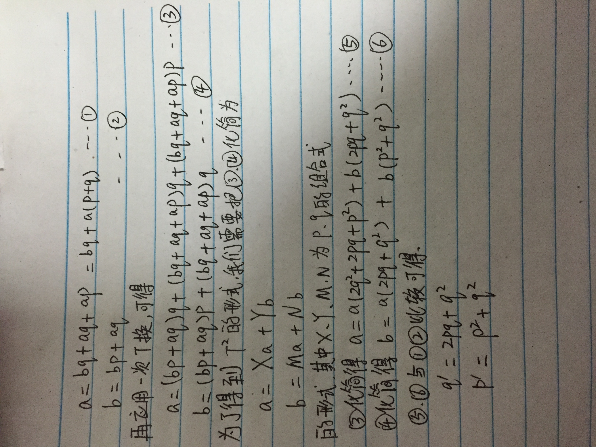
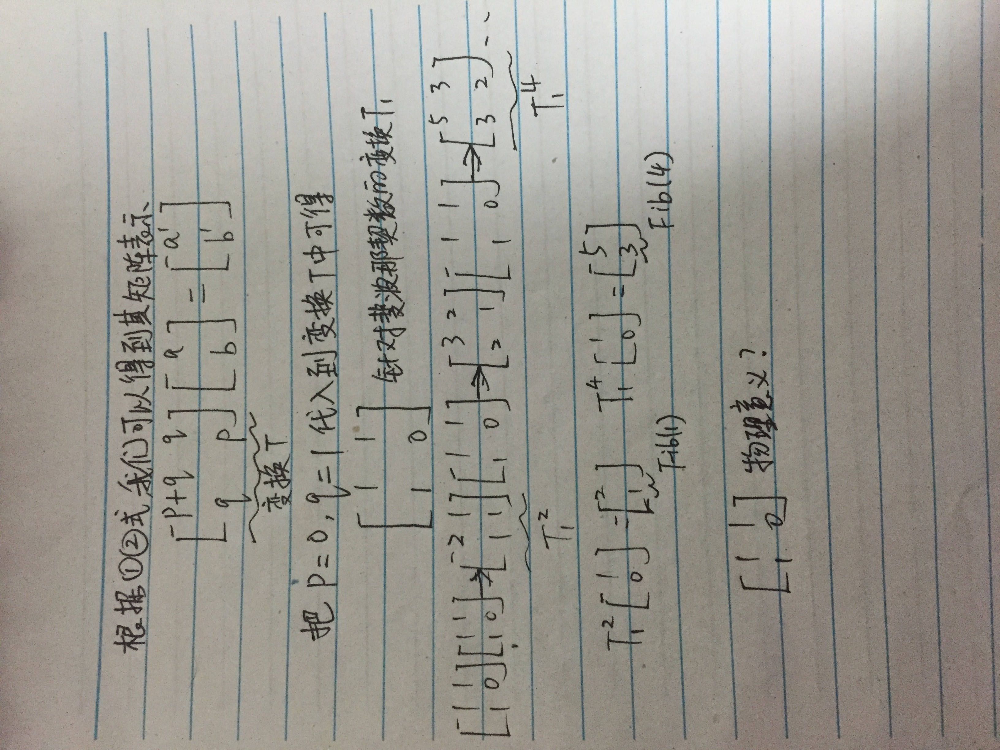

通过上图的推导，我们可以知道`p'`与`q'`的值。
```
(define (fib n)
  (fib-iter 1 0 0 1 n))
(define (fib-iter a b p q count)
  (cond 
    ((= count 0) b)
    ((even? count) 
      (fib-iter a
                b
                (+ (square p) (square q))
                (+ (* 2 p q) (square q))
                (/ count 2)))
    (else
      (fib-iter (+ (* b q) (* a q) (* a p))
                (+ (* b p) (* a q))
                p
                q
                (- count 1)))))
```

进一步扩展，如果把上面的变换T写成矩阵的形式，见下图：


这里我还有一个疑问，不知道T<sub>1</sub>的物理意义，回来看看线性代数的知识再把这点补上吧。